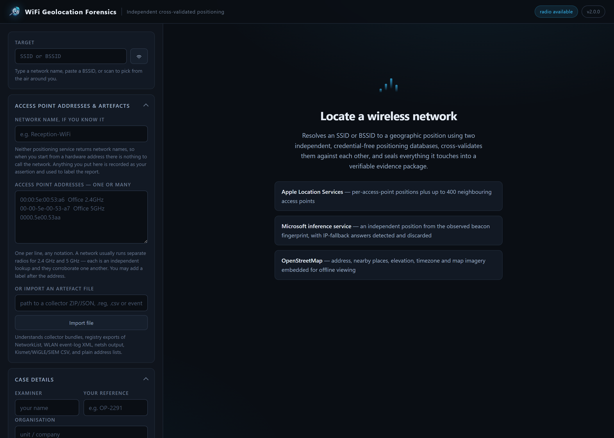
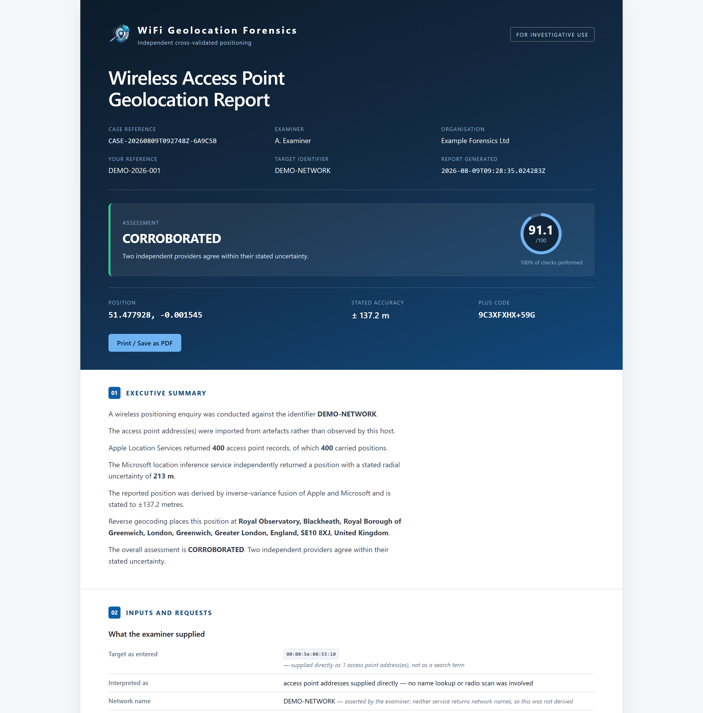

<div align="center">


# WiFi Geolocation Forensics

**Resolve a Wi-Fi access point to a geographic position, cross-validate it against two independent providers, and seal the whole thing into a hash-verified evidence package.**

No API keys · No accounts · No third-party Python packages

[](https://github.com/akhil-dara/wifi-geolocation-forensics/actions/workflows/ci.yml)
[](https://www.python.org/downloads/)
[](requirements.txt)
[](LICENSE)
[](#getting-started)

[Getting started](#getting-started) · [Using it](#using-it) · [Options](#options) · [What you get](#what-you-get) · [Limits](#limits)

</div>

---

## What it does

Give it an access point address. It returns a position, the working that produced it, and
a sealed package containing every byte it exchanged to get there.

```
$ wifigeo --bssid 00:00:5e:00:53:20 --ssid "Reception WiFi"

[ 25%] apple       Querying Apple Location Services for 1 BSSID(s) and up to 400 neighbours
[ 40%] apple       Apple returned 401 access points (401 with positions)
[ 53%] microsoft   Microsoft resolved 51.500000, -0.120000 (+/-131.0 m)
[ 55%] microsoft   4 of 4 groups resolved independently; they agree to within 40 m
[ 70%] analysis    Verdict: CORROBORATED (91/100, coverage 100%)
[100%] done        Complete. 84 exhibits, root hash 1be277a47790c429

  Verdict   : CORROBORATED  (90.7/100, 100.0% of checks run)
  Position  : 51.500000, -0.120000  +/- 35.2 m
  Plus Code : 9C3XGV2H+2X5
  MGRS      : 30U XC 99889 09362
  Address   : Waterloo Bridge, South Bank, Lambeth, London, SE1 8XZ, United Kingdom
  Report    : evidence\CASE-20260804T054958Z-5DC525_REPORT.html
  Evidence  : evidence\CASE-20260804T054958Z-5DC525_EVIDENCE.zip
  Root hash : 1be277a47790c42955e9e12f7528ad8de94a1ebd58509a6d7b852c5f84ec0e85
```

About 45 seconds, start to sealed package.

**What makes it different from a script that prints a coordinate:**

- **Two independent providers.** Apple answers per access point; Microsoft multilaterates
  a whole fingerprint. They are separate databases built by separate methods, so
  agreement between them is corroboration rather than a restatement.
- **Wrong answers are caught, not passed on.** Microsoft returns a position derived from
  *your own internet connection* when it holds no record for your beacons — it is
  detected and discarded. Randomised addresses shared by unrelated devices are detected
  and excluded. Both are reported with reasons rather than silently averaged in.
- **Every byte is evidence.** Requests and responses are written to disk before analysis,
  hashed, and sealed into a package that verifies itself on any machine.
- **Nothing to install and nothing to trust.** Pure Python standard library — the
  protobuf codec, the PNG encoder and the PDF writer are all part of the project.

<div align="center">

</div>

---

## Getting started

Pick one of the three. Each block says exactly which folder you end up in and what to run
from it.

### 1. Portable — Windows, nothing installed

Best for an evidence workstation, a USB stick, or a machine with no Python.

1. Download the `WGF-…-win64.zip` from
   **[Releases](https://github.com/akhil-dara/wifi-geolocation-forensics/releases)**.
   It bundles the current stable CPython, so it carries the latest security fixes and
   needs no Python on the machine.
2. Right-click the ZIP → **Extract All…** → extract anywhere, e.g. `D:\Tools\`.
3. Open the extracted folder. You will see:

```
D:\Tools\WGF\
    WGF.cmd            <-- double-click this to open the interface
    WGF-CLI.cmd        <-- for one-off command-line enquiries
    START-HERE.txt
    runtime\           the bundled Python; do not delete
    wifigeo\           the application
    evidence\          your cases are written here
```

4. **Double-click `WGF.cmd`.** A browser opens on a loopback-only local server. That is
   the whole setup.

For a single enquiry without the interface, from that same `WGF\` folder:

```bat
WGF-CLI.cmd --bssid 00:00:5e:00:53:a6 --ssid "Reception WiFi"
```

Cases land in `D:\Tools\WGF\evidence\`, beside the application, so the tool and its
output travel together.

### 2. From source — Windows, Linux, macOS

Python 3.9 or newer. There is nothing to `pip install`.

```bash
git clone https://github.com/akhil-dara/wifi-geolocation-forensics
cd wifi-geolocation-forensics
python3 -m wifigeo
```

You must be **inside the `wifi-geolocation-forensics` folder** when you run
`python3 -m wifigeo` — that is the folder containing `wifigeo/` and `README.md`. Running
it from anywhere else gives `No module named wifigeo`.

Cases are written to `wifi-geolocation-forensics/evidence/`.

> On Windows use `python` instead of `python3`. Every example below writes `python3`.

### Opening the interface

`python3 -m wifigeo` with no arguments starts a small local server and opens your
browser at it. The console tells you where it is:

```
  WiFi Geolocation Forensics  v2.0.0
  --------------------------------------------------------------
  Interface : http://127.0.0.1:8731/?token=Xk3p...
  Evidence  : /home/you/wifi-geolocation-forensics/evidence
  Bound to loopback only. Press Ctrl+C to stop.
```

- **If the browser did not open**, paste that `http://127.0.0.1:8731/` address into it
  yourself. Copy the line the console printed — if port 8731 was busy the tool quietly
  picks the next free one, so the number may differ.
- **`Ctrl+C` in the console stops it.** Closing the browser tab does not.
- **It is reachable only from this machine.** The server binds to `127.0.0.1`, so nothing
  on your network can see it. The `token` in the URL authorises the page's own API calls;
  you do not need to type it.
- **Nothing is uploaded.** The interface is served from `wifigeo/web/` on your own disk.
  The only outbound traffic is the positioning and map lookups a run makes.

Use `--port 9000` for a different port, and `--no-browser` to start the server without
opening one.

### Running a single enquiry instead

If you would rather not use the interface at all:

```bash
python3 -m wifigeo --bssid 00:00:5e:00:53:a6 --ssid "Reception WiFi"
```

That runs once, prints the result, writes the report and evidence package, and exits.

### 3. Installed — a `wifigeo` command anywhere

```bash
cd wifi-geolocation-forensics
pip install .
```

Now the folder no longer matters — run `wifigeo` from anywhere:

```bash
wifigeo --bssid 00:00:5e:00:53:a6 --ssid "Reception WiFi"
wifigeo                                  # opens the interface
```

Installed this way, cases go to `~/WGF-Evidence` (`%USERPROFILE%\WGF-Evidence` on
Windows) rather than into the installation. Override with `--evidence DIR`.

`requirements.txt` exists and is deliberately empty — running
`pip install -r requirements.txt` installs nothing and succeeds.

### Checking it works

```bash
python3 -m wifigeo --version
python3 -m unittest discover -s tests     # 183 tests, no network needed
```

---

## Where the input comes from

The tool needs an access point address (BSSID). Built-in commands give you one:

- **One scan, fed in whole** — everything audible at one moment. More addresses give a
  tighter position, so paste all of it rather than picking a few lines.
- **Addresses gathered over time** — you get a location history, one entry per place.

### Networks in range right now

**Windows**

```bat
netsh wlan show networks mode=bssid
```

```bat
netsh wlan show interfaces
```

The first lists every network the radio can hear with its BSSIDs; the second shows just
the one you are connected to. Save either to a file and feed it straight in with
`--import`, or copy a `BSSID` line by hand.

**Linux**

```bash
nmcli -f BSSID,SSID,SIGNAL,CHAN device wifi list
```

```bash
iw dev wlan0 scan | grep -E "^BSS|SSID:"
```

`nmcli` is easiest where NetworkManager is running. `iw` needs the interface name — find
it with `iw dev` — and usually root.

**macOS**

```bash
system_profiler SPAirPortDataType
```

```bash
sudo wdutil info
```

`system_profiler` lists what is in range; `wdutil` reports the current connection. The
old `airport -s` command was removed in recent macOS versions.

### Letting the tool do it

On Windows the radio can be read directly, with no external commands:

```bash
python3 -m wifigeo --scan
```

That prints what is in range and exits. Note that this is an **active** scan: the radio sends probe requests, so it is detectable locally and it changes the RF environment. Nothing is sent over the internet — no address leaves the machine — but the scan itself is not passive.

---

## Using it

### Locating an access point

```bash
python3 -m wifigeo --bssid 00:00:5e:00:53:a6 --ssid "Reception"
```

Nothing touches your radio. `--ssid` is optional and only labels the report — neither
provider returns network names, so anything you put there is recorded as your assertion.

A network usually runs separate radios for 2.4 GHz and 5 GHz. Give it both; each is an
independent lookup and they corroborate one another:

```bash
python3 -m wifigeo --bssid 00:00:5e:00:53:a6 --bssid 00:00:5e:00:53:a7
```

Addresses are accepted in **any** notation:

```
00:00:5e:00:53:a6      IEEE / Linux / Apple
00-00-5E-00-53-A6      Windows
0000.5e00.53a6         Cisco
00 00 5e 00 53 a6      pasted from a spreadsheet
00005e0053a6           bare
0:0:5e:0:53:a6         unpadded, as Apple returns them
```

In the interface's paste box you can add a signal strength and a label per line:

```
00:00:5e:00:53:a6  -52  Office 2.4GHz
00:00:5e:00:53:a7  -61  Office 5GHz
```

### Starting from a network name

Neither provider accepts an SSID, so a name has to be resolved to addresses by a radio
that can actually hear it — yours:

```bash
python3 -m wifigeo --radio-scan "Reception WiFi"
```

Scanning changes the local RF environment, so it never happens unless you ask. Windows
only. If the network is out of range, see [Limits](#limits).

### Importing addresses from artefacts

```bash
python3 -m wifigeo --import scan.txt
```

Reads saved `netsh wlan show networks` output, or a plain list of addresses.
Addresses belonging to the host's own adapter are recognised and excluded — a client
radio is not an access point.

Addresses that fall in more than one place are reported as a location history rather
than averaged into one coordinate:

```
  3 distinct places
    1. 51.507400, -0.127800   4 network(s)   2026-01-04 to 2026-08-01
       00:00:5e:00:53:a6  HQ-Corp        last seen 2026-08-01
    2. 55.953300, -3.188300   1 network(s)   2026-03-11 to 2026-03-14
       00:00:5e:00:53:b1  Hotel-Guest    last seen 2026-03-14
```

Use `--observed-at` when positioning a single address recovered by hand, so the report
states when the beacon was *seen* rather than when you looked it up:

```bash
python3 -m wifigeo --bssid 00:00:5e:00:53:a6 --observed-at 2026-03-04T09:15:22Z
```

### This machine's own history

```bash
python3 -m wifigeo --host-artefacts
```

Recovers the access points this machine has previously joined, from the registry and the
WLAN event log, and locates each one. Windows only, and the registry keys are restricted
to Administrators — run it from an elevated shell.

### A report you can hand to someone else

```bash
python3 -m wifigeo --bssid 00:00:5e:00:53:a6 --redact
```

Writes `CASE-…_REPORT.REDACTED.html` and `.REDACTED.pdf` alongside the originals and
prints all four paths. The redacted copies show vendor prefixes only
(`00:00:5e:xx:xx:xx`), coordinates truncated to two decimal places, and no street
address, map, examiner or file paths. Case identifiers, hashes, verdicts, scores and
every methodological statement are kept — it removes identifying detail, not the
reasoning.

Coordinates are **truncated, not scrambled**, so a reader can see the precision was
reduced rather than being handed a plausible-looking lie. The copy carries a banner
saying so on its face and still quotes the evidence root hash, so a recipient given
nothing else can tie it back to the sealed package. **The evidence package itself is
never redacted.**

---

## Options

| Option | What it does |
|---|---|
| `--bssid MAC` | Access point address to locate. Repeatable. |
| `--ssid NAME` | Network name, for labelling the report. Recorded as your assertion. |
| `--import FILE` | Read addresses from a file: saved `netsh` output, or a plain list. |
| `--host-artefacts` | Locate every network this machine has joined. Windows, elevated. |
| `--radio-scan` | Scan the radio to resolve an SSID. Off by default. Windows only. |
| `--scan` | List what the radio can see, then exit. |
| `--redact` | Also write a distributable copy with identifying detail removed. |
| `--observed-at ISO8601` | When the beacons were observed, if not now. |
| `--neighbours 1-400` | Neighbouring access points to harvest. Default 400. |
| `--replicates N` | Disjoint groups to multilaterate independently. Default 4, `0` disables. |
| `--no-microsoft` | Skip the Microsoft cross-check. |
| `--no-enrichment` | Skip address, places, elevation and daylight lookups. |
| `--no-tiles` | Do not embed map imagery in the report. |
| `--send-device-profile` | Send the optional element identifying your machine. Off by default. |
| `--msft-api-version v22\|v21` | Which Microsoft endpoint version to use. |
| `--evidence DIR` | Where to write cases. |
| `--examiner`, `--organisation`, `--reference` | Case metadata for the report. |
| `--json` | Print the full result as JSON. |
| `--port`, `--no-browser` | Interface port; do not open a browser. |

Full list: `python3 -m wifigeo --help`.

---

## What you get

<div align="center">

</div>

Each run writes:

```
evidence\
    CASE-…_REPORT.html            the report, quoting the sealed root hash
    CASE-…_REPORT.pdf
    CASE-…_REPORT.REDACTED.html   only with --redact
    CASE-…_REPORT.REDACTED.pdf
    CASE-…_EVIDENCE.zip           the sealed, self-verifying package
    CASE-…\                       the same contents, unzipped
```

Inside the package:

```
case.json           metadata, provenance, findings, transaction index
audit.jsonl         append-only activity log
exhibits\           one directory per HTTP transaction, nothing filtered
  0002_microsoft.inference\
    request.headers.txt
    request.body.bin              the gzip actually transmitted
    request.body.decoded.xml      the same, readable
    response.headers.txt
    response.body.wire.bin        exactly as received
    response.body.decoded.xml
    meta.json                     SHA-256 of both directions
artifacts\          scan results, resolved positions, the report
exports\            report.pdf · map.png · map.svg · positions.csv/.geojson/.kml
manifest.json       SHA-256 of every file
MANIFEST.sha256     one root hash over the whole manifest
verify_evidence.py  standalone verifier
```

### Verifying a package

Extract the ZIP, go into the `CASE-…` folder, and run the verifier that ships inside it:

```bash
cd CASE-20260804T054958Z-5DC525
python3 verify_evidence.py        # 'py verify_evidence.py' on Windows
```

Exit 0 means intact. It needs nothing but Python — not this tool, not the internet — so
a recipient can check the package without trusting anything you sent them. Change one
byte of one exhibit and it names the file:

```
MODIFIED: exhibits/0001_apple.wloc.batch01/response.body.wire.bin
RESULT: FAILED - package does not verify
```

---

## The confidence score

The verdict is a sum of named, individually weighted checks, each reported with its own
contribution — so an analyst can disagree with one line rather than with a number.

Two rules keep it honest:

- **A check that could not be run is excluded, not scored zero.** If a provider is
  unreachable, that says nothing about the position. The report states what percentage of
  the checks actually ran.
- **`CORROBORATED` requires genuine agreement between two providers.** Where only one
  answered, the verdict reads `SINGLE-SOURCE` however well everything else scored.

---

## Limits

**A network name alone cannot be positioned.** Neither provider accepts an SSID, and
there is no credential-free database mapping a name to its access points. A name is
resolved to addresses *locally*, by your own radio. Out of range means out of reach.

**These positions are not measurements.** They are third-party crowd-sourced records of
where an access point was observed, at an unstated earlier time.

**Access points move.** A relocated router or a mobile hotspot keeps returning its old
recorded position until the database catches up. Neither provider timestamps its records.

**Absence is not proof of absence.** An access point with no record has simply never been
reported by a contributing device.

**Addresses can be forged**, so a hit can be induced deliberately.

Findings are investigative leads. Corroborate them by independent means.

---

## Why no dependencies

Every package that is not there is one more thing that cannot break the build, cannot
bloat the portable distribution, and cannot change what the tool does between one run and
the next. The protobuf codec is about 120 lines you can point at and say *this is exactly
how the bytes were interpreted*. The PNG and PDF writers exist for the same reason.

Both wire formats are implemented in `wifigeo/apple.py` and `wifigeo/msft.py`,
which document what each field is and how it was established.

---

## Legal

For authorised investigation, security research and education. Positions are derived from
publicly reachable services using no credentials. You are responsible for having lawful
authority for any enquiry you run. See [SECURITY.md](SECURITY.md) for what the tool sends
and to whom.

## Licence

MIT — see [LICENSE](LICENSE).

Map data © OpenStreetMap contributors, ODbL.
